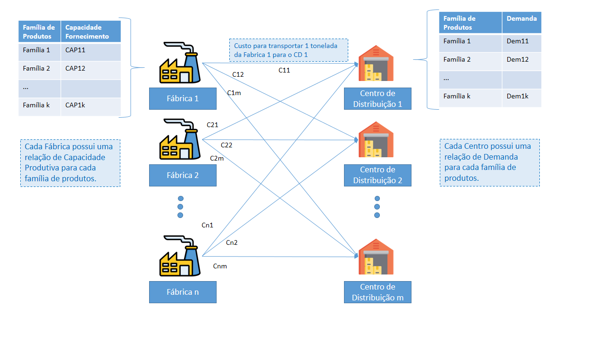
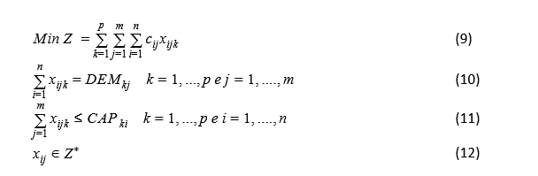

# problema-transporte-ind-alimentos
Esse projeto consiste na aplicação de Programação Linear Inteira para resolução de um problema de transporte para uma indústria de alimentos. O problema foi trabalhado com o Gurobi em Python. 

# Introdução

Primeiro é apresentado os índices utilizados no modelo:
i =0 até n, referente às fábricas, onde n é o total;
j =0 até m, indica os centros de distribuição; 
k =0 até prepresenta a cada família de produtos, como suínos, aves, entre outros. 

Sabendo dos índices, os parâmetros, que são referentes aos dados coletados para operação da resolução, estão apresentados pelo Quadro 1. Com isso é possível identificar que esse modelo possui variáveis de decisão, que representa a quantidade do produto de família k produzida por i e entregue para j.  Esse termo é representado matematicamente por xijk, como a quantidade de produto k, fornecido por i e entregue para o centro de distribuição j. 

| Símbolo | Descrição                                                           | Intervalo             |
|---------|---------------------------------------------------------------------|-----------------------|
| cij     | Custo de Transporte da fábrica i para j por tonelada. [R $ /Tonelada] | i =0 até n j =0 até m |
| DEMkj   | Demanda do produto k no centro de Distribuição j .                  | k =0 até p j =0 até m |
| CAPki   | Capacidade produtiva do produto k na fábrica i                      | k =0 até p i =0 até n |
| dij     | Distância de Transporte da fábrica i para j.                        | i =0 até n j =0 até m |

# Metodologia

O problema foi resolvido em Python 3 Notebook com Jupyter. Para resolução dos dados e construção do modelo foi utilizado o Solver GUROBI. 

# Reulstados

Os resultados obtidos foram escritos em .csv e .txt para melhor organização e apresentação dos dados. 
